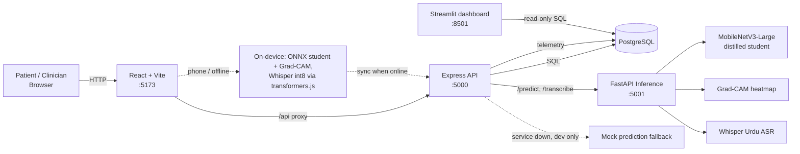
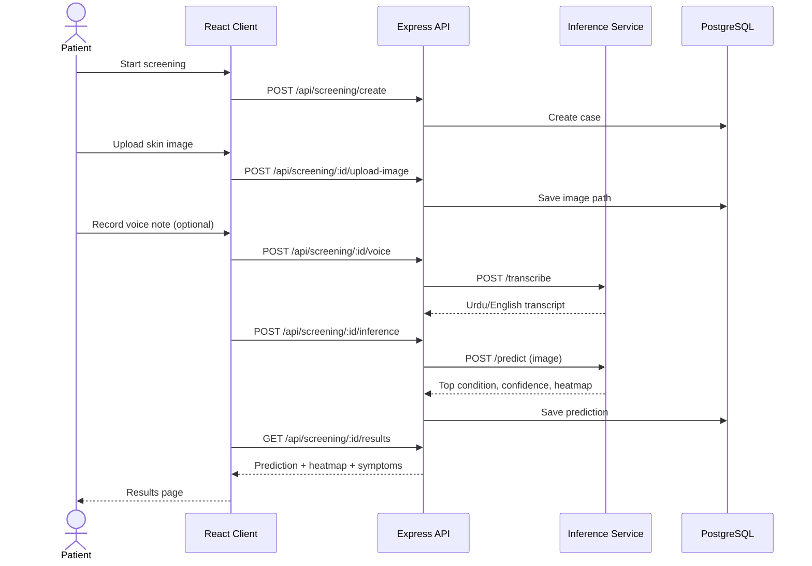

# SkinSense

AI-assisted dermatological screening for low-income, low-connectivity settings. Patients upload a skin photo and (optionally) describe symptoms by voice in Urdu or English. A lightweight distilled model predicts the likely condition and produces a Grad-CAM heatmap. Clinicians can review cases through a separate portal.

It runs in two ways:
- **PC / server:** Docker Compose stack (PostgreSQL, Express API, FastAPI inference on CPU, Caddy with HTTPS). See [deploy/README.md](deploy/README.md).
- **Phone:** the web app installs as a PWA and runs **both** the skin model and our Urdu Whisper **on the device**, offline. Screenings done offline are kept on the phone and upload to the account when the connection returns.

**Current model:** MobileNetV3-Large, 320×320 input, distilled from an EfficientNet-B3 teacher and CLIP. Honest accuracy on the leak-free test split: **73.70 ± 0.81 %** (3 seeds), top-3 96.6 %, macro-F1 70.4. It also has an 8th output, *not a skin lesion*: photos of animals, objects, scenes or textures are rejected with a "please retake" message instead of getting a diagnosis (10 of 172 real non-skin test photos still get through, down from 56). The weekend that produced it (and why earlier numbers like 74.98 % were inflated) is written up in [documentation/WEEKEND_REPORT.md](documentation/WEEKEND_REPORT.md).

> **Disclaimer:** SkinSense is a screening aid, not a diagnostic tool. It does not replace a qualified clinician.

## Target Conditions
Vitiligo, Melasma, Psoriasis, Eczema, Tinea, Contact Dermatitis, Seborrheic Dermatitis.

## Architecture



### Screening flow



If the inference service is unreachable, the Express server falls back to **mock predictions** in development (`model_version` contains "mock"). In production (`NODE_ENV=production`) it returns 503 instead, and the PWA runs the model on the device. Predictions made on a phone carry a `model_version` ending in `-onnx`.

## Tech Stack
| Layer | Tech |
|---|---|
| Frontend | React 19, Vite 7, Tailwind 4, react-router, i18next (English/Urdu), Leaflet |
| Backend | Node.js, Express 4, PostgreSQL, JWT auth, multer |
| Inference | FastAPI, PyTorch, MobileNetV3-Large (student model distilled from a teacher), Grad-CAM, Whisper Urdu ASR |
| On-device (PWA) | ONNX Runtime Web (student + closed-form Grad-CAM, 13 MB), transformers.js (whisper-small Urdu, int8, 330 MB), Workbox service worker, IndexedDB outbox |
| Training | PyTorch notebooks (`notebooks/`) |

## Repository Layout
```
client/          React web app (patient + clinician portals)
server/          Express API, migrations, tests
dashboard/       Streamlit runtime-monitoring console
inference/       FastAPI ML service, model weights, tests, ONNX export (export_mobile.py)
deploy/          Docker Compose production stack, Caddyfile, deployment guide
models/          Trained checkpoints (teacher, student, fine-tuned)
notebooks/       Data exploration, preprocessing, training
documentation/   Setup, ML integration and testing guides
```

## Datasets
DermaCon-IN, SCIN, SkinDisNet.

## Quick Start
Prerequisites: Node.js 20.19+, Python 3.10+, PostgreSQL, Git + Git LFS.

Full instructions: [documentation/SETUP_INSTRUCTIONS.md](documentation/SETUP_INSTRUCTIONS.md)

```bash
git clone <repo-url> && cd <repo>
git lfs install && git lfs pull        # model weights are stored in Git LFS

# Terminal 1 - inference (5001)
cd inference && pip install -r requirements.txt && python download_asr_model.py && python server.py

# Terminal 2 - backend (5000)
cd server && npm install && cp .env.example .env && npm run dev

# Terminal 3 - frontend (5173)
cd client && npm install && npm run dev
```

## Production Deployment
- **PC / server:** `cd deploy && cp .env.example .env` (fill in the secrets), then `docker compose up -d --build`. Full guide, HTTPS options and sizing: [deploy/README.md](deploy/README.md).
- **Phone:** open the site over HTTPS and use the browser's *Install app* / *Add to Home screen*. The first on-device screening downloads the skin model (13 MB); the first voice note downloads Whisper (330 MB, once). After that, screening works with no connection.
- **Rebuilding the phone models:** `python inference/export_mobile.py` (skin model) and the Whisper export steps in [documentation/WEEKEND_REPORT.md](documentation/WEEKEND_REPORT.md#10-production-deployment-pc--mobile-pwa).

## Runtime Validation and Monitoring
- **Input guards** (inference service): rejects empty or oversized files, images with no skin tones, and blurry photos; low-confidence or near-uniform predictions are reported as *Inconclusive* instead of a forced diagnosis.
- **Honest model status:** `/health` reports whether real weights are loaded; results from an untrained fallback are tagged `-UNTRAINED`.
- **Device telemetry:** the browser reports coarse capabilities (cores, rounded RAM, JS heap, network tier) and the inference service reports per-stage latency, memory and GPU usage. Everything is stored per screening in `device_telemetry`.
- **Dashboard:** `streamlit run dashboard/app.py` shows median / p95 latency, stage breakdown and low-resource device share.

## Testing
```bash
cd server && npm test
cd client && npm test
cd inference && python -m pytest tests/ -v
cd dashboard && python -m pytest tests/ -v
```
See [documentation/TESTING.md](documentation/TESTING.md).

## Documentation
- [Setup instructions](documentation/SETUP_INSTRUCTIONS.md)
- [ML integration guide](documentation/ML_INTEGRATION_GUIDE.md)
- [Testing guide](documentation/TESTING.md)
- [Production deployment](deploy/README.md)
- [Weekend report (2–5 Oct 2026): everything tested, changed, kept and dropped](documentation/WEEKEND_REPORT.md)
- [Accuracy experiments](documentation/ACCURACY_EXPERIMENTS.md)

## Project Status
Deployable: server-side inference for PCs, and an installable PWA with fully on-device inference (image + speech) for phones. Open items (label clean-up, group-aware split, branches B/C benchmark rows) are listed at the end of the [weekend report](documentation/WEEKEND_REPORT.md#open-issues-and-next-steps).

## Team

**FAST NUCES, Islamabad** - Final Year Project

| Name | Roll No. |
|---|---|
| Usman Haroon | 22i-1177 |
| Ayan Asif | 22i-1097 |
| Ibrahim Azhar | 22i-0928 |

**Supervisor:** Ma'am Azka Atiq
