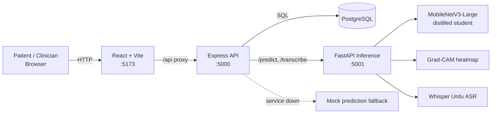
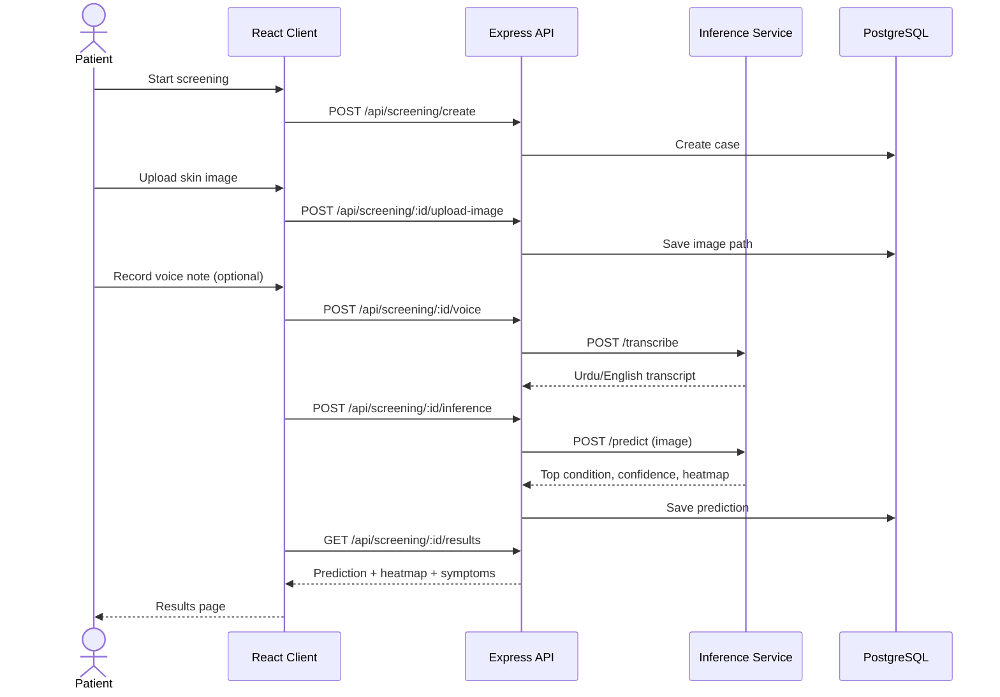

# SkinSense

AI-assisted dermatological screening for low-income, low-connectivity settings. Patients upload a skin photo and (optionally) describe symptoms by voice in Urdu or English. A lightweight distilled model predicts the likely condition and produces a Grad-CAM heatmap. Clinicians can review cases through a separate portal.

> **Disclaimer:** SkinSense is a screening aid, not a diagnostic tool. It does not replace a qualified clinician.

## Target Conditions

Vitiligo, Melasma, Psoriasis, Eczema, Tinea, Contact Dermatitis, Seborrheic Dermatitis.

## Architecture



### Screening flow



If the inference service is unreachable, the Express server falls back to **mock predictions** (`model_version` contains "mock"), so always check the model version when validating results.

## Tech Stack

| Layer     | Tech                                                                                                     |
| --------- | -------------------------------------------------------------------------------------------------------- |
| Frontend  | React 19, Vite 7, Tailwind 4, react-router, i18next (English/Urdu), Leaflet                              |
| Backend   | Node.js, Express 4, PostgreSQL, JWT auth, multer                                                         |
| Inference | FastAPI, PyTorch, MobileNetV3-Large (student model distilled from a teacher), Grad-CAM, Whisper Urdu ASR |
| Training  | PyTorch notebooks (`notebooks/`)                                                                         |

## Repository Layout

```
client/          React web app (patient + clinician portals)
server/          Express API, migrations, tests
inference/       FastAPI ML service, model weights, tests
models/          Trained checkpoints (teacher, student, fine-tuned)
notebooks/       Data exploration, preprocessing, training
documentation/   Setup, ML integration and testing guides
```

## Datasets

DermaCon-IN, SCIN, SkinDisNet.

## Quick Start

Prerequisites: Node.js 20.19+, Python 3.10+, PostgreSQL, Git + Git LFS.

Full instructions: [documentation/SETUP_INSTRUCTIONS.md](documentation/SETUP_INSTRUCTIONS.md)

```bash
git clone <repo-url> && cd <repo>
git lfs install && git lfs pull        # model weights are stored in Git LFS

# Terminal 1 - inference (5001)
cd inference && pip install -r requirements.txt && python download_asr_model.py && python server.py

# Terminal 2 - backend (5000)
cd server && npm install && cp .env.example .env && npm run dev

# Terminal 3 - frontend (5173)
cd client && npm install && npm run dev
```

## Testing

```bash
cd server && npm test
cd client && npm test
cd inference && python -m pytest tests/ -v
```

See [documentation/TESTING.md](documentation/TESTING.md).

## Documentation

- [Setup instructions](documentation/SETUP_INSTRUCTIONS.md)
- [ML integration guide](documentation/ML_INTEGRATION_GUIDE.md)
- [Testing guide](documentation/TESTING.md)

## Project Status

Current focus: web portal with server-side inference. On-device deployment (TensorFlow Lite / mobile app) is planned future work and is not part of the current codebase.

## Team

**FAST NUCES, Islamabad** - Final Year Project

| Name          | Roll No. |
| ------------- | -------- |
| Usman Haroon  | 22i-1177 |
| Ayan Asif     | 22i-1097 |
| Ibrahim Azhar | 22i-0928 |

**Supervisor:** Ma'am Azka Atiq
