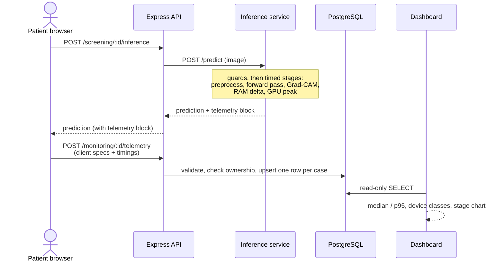

# SkinSense: Tracking, Monitoring and Runtime Validation

Context document for the `feature/runtime-device-monitoring` branch.
Last updated: 30 September 2026.

**Purpose of this work:** show, with measured data, that SkinSense is usable on low-resource client devices because the heavy computation runs on the server, and protect the pipeline from bad inputs and misleading results.

Deployment, alerting and production hardening are intentionally out of scope for this stage.

---

## 1. What was built

| Area | What it does | Where |
|---|---|---|
| Telemetry storage | One row of hardware and timing data per screening | `server/migrations/003_device_monitoring.sql` |
| Server-side profiling | Times each inference stage, measures RAM delta and GPU peak memory | `inference/server.py` |
| Runtime guards | Rejects empty, oversized, non-skin and blurry images; flags low-confidence predictions as *Inconclusive* | `inference/quality.py`, `inference/server.py` |
| Ingestion API | `POST /api/monitoring/:caseId/telemetry` with auth, ownership check, range validation, rate limit | `server/src/controllers/monitoringController.js`, `routes/monitoring.js`, `middleware/telemetryLimiter.js` |
| Client capture | Reads cores, rounded RAM, page JS heap, network tier from the browser | `client/src/utils/telemetry.js`, `client/src/pages/ScreeningPage.jsx` |
| Dashboard | Streamlit console with median / p95 latency, stage breakdown, device classes | `dashboard/app.py`, `dashboard/metrics.py` |

## 2. Data flow

## 3. What is measured

### 3.1 Reported by the browser (best effort)
| Field | Source | Caveat |
|---|---|---|
| `device_cores` | `navigator.hardwareConcurrency` | Logical cores, not physical |
| `device_memory_gb` | `navigator.deviceMemory` | Rounded to a power of two, **capped at 8 GB**, Chromium only |
| `client_ram_used_mb` | `performance.memory.usedJSHeapSize` | JS heap of **this page only**, Chromium only. Not total or free device RAM |
| `effective_connection`, `client_rtt_ms` | Network Information API | Estimate; missing on Safari and Firefox |
| `browser_user_agent` | `navigator.userAgent` | Truncated to 300 characters on the server |
| `audio_processing_ms` | Recorder | Currently the **length of the voice recording**, not compute time (see section 7) |

Missing values are stored as `NULL` and excluded from statistics. They are never replaced by defaults.

### 3.2 Reported by the inference service
| Field | Meaning |
|---|---|
| `image_preprocess_ms` | Decode, validity checks, resize and normalise |
| `model_inference_ms` | MobileNetV3 forward pass (GPU work is synchronised before the timer stops) |
| `gradcam_generation_ms` | Grad-CAM pass, overlay and PNG write |
| `total_server_time_ms` | Whole `/predict` handler |
| `server_ram_used_mb` | Change in process RSS during the request (approximate) |
| `gpu_vram_used_mb` | Peak GPU memory for the request (0 on CPU) |
| `device_type` | `cpu` or `cuda` |
| `blur_score`, `entropy`, `confidence_margin` | Guard inputs. Returned but **not yet stored** |

Requests are processed one at a time (the handler is `async def` with no awaits after upload), which is what keeps the RAM and VRAM figures per-request. The model is warmed up at startup so the first request does not include one-off initialisation.

## 4. Runtime guards (inference service)

Order of checks in `/predict`:

1. Empty file: 400 `EMPTY_FILE`
2. Larger than 10 MB: 413 `FILE_TOO_LARGE`
3. Not a decodable image: 400 `INVALID_IMAGE`
4. No skin tones (HSV and YCrCb masks, at least 15% of pixels): 400 `NO_SKIN_DETECTED`
5. Too blurry (Laplacian variance below 20, measured with the longest side capped at 512 px): 400 `IMAGE_TOO_BLURRY`
6. After the forward pass, `assess_prediction` returns `out_of_scope` when top-1 confidence is at most 0.30, or entropy is above 1.65 with a top-2 margin below 0.08. The response then shows "No Disease / Inconclusive" instead of a forced class.

Other startup protections:
- A Git LFS pointer file in place of the weights stops the service with a clear message.
- If weights are missing, the service still starts but tags every result `-UNTRAINED`, and `/health` reports `model_loaded: false`.

**These thresholds have not been calibrated on labelled data.** See section 8.

## 5. Database

`device_telemetry` has one row per screening case (`UNIQUE (case_id)`), with the columns above plus `created_at`. Migration 003 is idempotent: it creates the table if missing, adds `client_ram_used_mb` for databases built from the first draft, removes older duplicate rows, then adds the unique index. Re-running it is safe.

## 6. Dashboard

Run: `cd dashboard && pip install -r requirements.txt && streamlit run app.py` (port 8501).

- Connects with `DASHBOARD_DB_USER` and `DASHBOARD_DB_PASSWORD` if set, otherwise `DB_USER` and `DB_PASSWORD`. There is no default password. The session is read-only.
- Tiles: total screenings, server latency, forward-pass latency (median with p95 and n), client JS heap (median with n out of total), share of low-resource devices.
- Low-resource means reported RAM of 4 GB or less, or a network of 3G or slower. Rows where the browser reported neither are counted as *Unknown*, not as standard devices.
- Filters: device profile, inference device, and exclude the first run.
- Chart: median server stage latency (image prep, inference, Grad-CAM). Voice recording length is not a pipeline stage and is not charted.

## 7. Known limitations (be upfront about these in the report)

1. **Small, single-machine sample.** The first dashboard readings (30 Sep 2026) had 4 screenings, all from one 8-core, 8 GB laptop on a 4g connection, so 0 of 4 were classified low-resource. That shows the pipeline works. It does **not** yet show behaviour on low-end devices. Repeat runs with CPU throttling and ideally a real budget phone are still needed.
2. **JS heap is coverage-limited.** Only 2 of those 4 rows had a heap value, because the first two were recorded before heap capture was added. Median 15.4 MB (n = 2).
3. **Sample readings (n = 4, unreliable for conclusions):** median server latency 1262 ms (p95 2216 ms), median forward pass 314 ms (p95 543 ms).
4. **Voice metric is mislabelled.** `audio_processing_ms` holds the recording length in milliseconds. It was previously charted as "Audio Prep" at about 7000 ms, which was misleading, so the chart now leaves it out. Either rename the column later or measure real transcription time from `/transcribe`.
5. **Server timings travel through the client.** The browser forwards the inference service's timings to the monitoring endpoint, so a modified client could submit false server metrics. The server should store them itself from the inference response.
6. **The client waits for the telemetry request** before navigating to results. It is wrapped in try/catch, so failure never blocks the screening, but it adds a small delay.
7. **Guard thresholds are hand-picked** and could wrongly reject valid low-light photos from cheap phones.
8. **`psutil` RAM delta is approximate** (RSS changes are noisy).
9. **Threshold mismatch:** the client treats exactly 0.30 confidence as "low", while the server treats it as out of scope.

## 8. Next: runtime validation

Do now, independent of the model:
- Store `blur_score`, `entropy` and `confidence_margin` (needed later for calibration).
- Server stores inference timings itself, and the client sends only browser fields.
- Request IDs passed from client to server to inference, with structured logs (no patient data).
- Extended `/api/health`: database, inference reachability, model loaded, mock or untrained state.
- `is_mock` flag on predictions and a UI banner when a result is mock or untrained.
- Timeout, retry and circuit breaker on the server-to-inference call.
- Validate the inference response shape before saving it.
- One shared definition of confidence bands and thresholds across client and server.
- Fix `audio_processing_ms` (send `null` when no voice was submitted; rename or measure properly).

Do after the CLIP model is merged (these depend on the model's output distribution):
- Calibrate blur, skin, confidence and entropy thresholds on a labelled set (good, blurry, low-light, non-skin, and each class).
- Golden-image regression set and model comparison (MobileNet vs CLIP): accuracy, latency, memory, model size.
- Benchmark table on throttled and real low-end devices, CPU only.

## 9. Commit history on the branch

A GitHub Actions workflow running all four suites was also added (`75feb79`).

Original commits: schema, inference profiling, ingestion endpoint, client telemetry, dashboard, JS heap capture and UI polish.
Follow-up fixes: telemetry validation and ownership checks, one row per case, `quality.py` guards with warm-up and LFS check, client nulls instead of defaults, dashboard without fabricated defaults (median / p95, read-only DB, tests), updated docs, and removal of voice duration from the stage chart.

For test details see [TESTING_INVENTORY.md](TESTING_INVENTORY.md).
